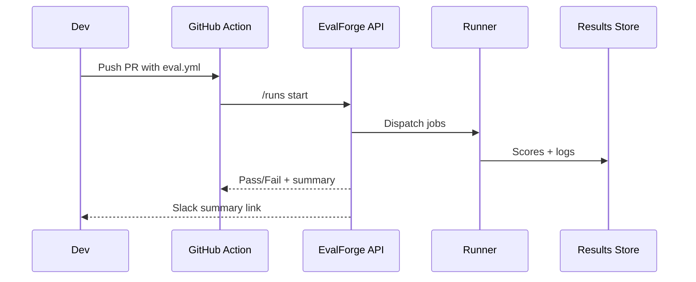
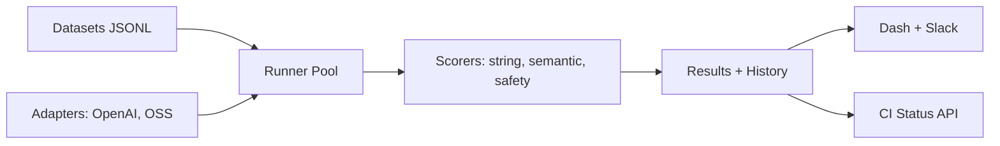

# PRD: EvalForge — LLM Evals and Safety Tests API

## Summary

Problem: LLM features ship without guardrails or regressions.
Goal: declarative evals, safety tests, and CI gates.
ICP: teams building LLM features.
Non-goals: full experiment platform, human labeling at scale.

## Users and jobs

- ML engineer: “Run repeatable evals before merge.”
- Product engineer: “Fail CI if score drops.”
- Policy owner: “Track safety tests.”

## Success metrics

- CI job time ≤ 8 minutes for 1k items.
- Determinism across repeated runs within tolerance.
- Adoption in at least three repos per tenant.

## Functional requirements

- Dataset format with split tags.
- Runners for string, semantic, and safety scoring.
- Model adapters for hosted and OSS.
- Thresholds and gates.
- Run history and diffs.
- Slack summaries.
- CLI and GitHub Action.

## Non functional requirements

- Rate limits and backoff.
- Cost caps per run.

## Flow

## Data model

- Dataset, Run, ItemResult, Metric, Threshold, ModelAdapter.

## Minimal API

- `POST /v1/runs` body: dataset_id, adapter, scorers, thresholds.
- `GET /v1/runs/{id}` status and metrics.
- `POST /v1/thresholds` set gates.
- `POST /v1/tokens/cost-cap` per project.

## Security

- Vault for provider keys.
- Per run cost cap and dry run.

## Risks

- Vendors ship similar features. Focus on CI gates and repeatability.
- Scoring drift. Pin judge versions and seeds.

## MVP scope

- Datasets, runners, adapters, scorers, thresholds, CI action, Slack, billing.

## MVP dev plan

Week 1

- Dataset schema and storage.
- Runner pool and string scorer.
- CLI and REST.

Week 2

- Semantic and toxicity scorers.
- GitHub Action and Slack.
- Stripe and cost caps.

Testing

- Golden set for regressions.
- Determinism with seeded runs.

Launch checklist

- Sample repo and tutorial.

MRR prior

- Median 6w $199. Median 12w $398.

