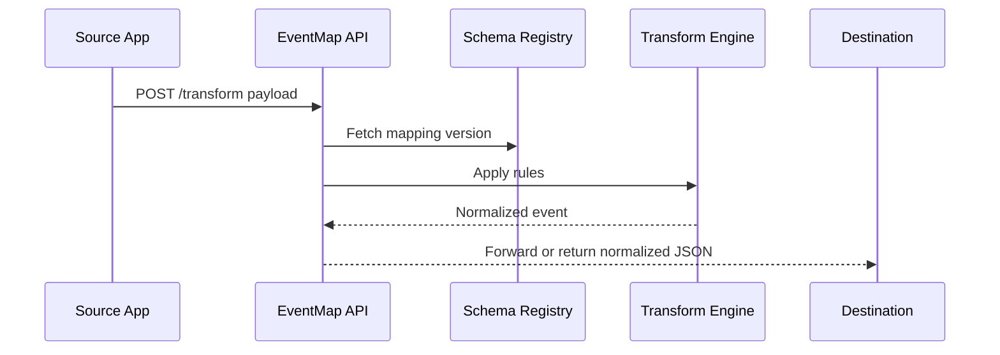
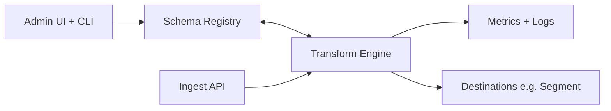

# PRD: EventMap — Event Schema Normalization API

## Summary

Problem: messy analytics events across sources.
Goal: normalize to a clean schema with versioning and fast transforms.
ICP: product analytics teams and data engineers.
Non-goals: full CDP, heavy ETL orchestration.

## Users and jobs

- Analyst: “Trust event names and properties.”
- Engineer: “Deploy a mapping and roll back fast.”
- PM: “See event volumes by canonical name.”

## Success metrics

- p95 transform latency ≤ 10 ms at 1k rps.
- Rollback time ≤ 1 minute.
- Zero data loss in mapping updates.

## Functional requirements

- Schema registry for canonical events.
- Mapping rules for alias names and property renames.
- Transform engine for JSON payloads.
- Versioning with diffs and rollback.
- SDKs Node and Python.
- CLI for CI.
- Metrics per mapping.

## Non functional requirements

- Idempotent transforms.
- Deterministic and testable.

## Flow

## Data model

- Project, Schema, MappingVersion, Rule, TransformRun, Metric.

## Minimal API

- `POST /v1/transform` input event.
- `POST /v1/mappings` create new version.
- `POST /v1/mappings/{id}/deploy`.
- `POST /v1/mappings/{id}/rollback`.

## Security

- API keys per project.
- Payload sampling and redaction options.

## Risks

- Edge latency budgets. Use colocated edge workers and caching.
- Mapping complexity creep. Keep rule language small.

## MVP scope

- Registry, rules, transform, versioning, metrics, SDKs, CLI, billing.

## MVP dev plan

Week 1

- Registry and rule engine.
- Transform API.
- Node SDK.

Week 2

- CLI, Python SDK.
- Versioning with diffs and rollback.
- Metrics and Stripe.

Testing

- Golden test vectors for transforms.
- Latency tests at 1k rps.

Launch checklist

- Docs with patterns and anti patterns.

MRR prior

- Median 6w $198. Median 12w $495.

