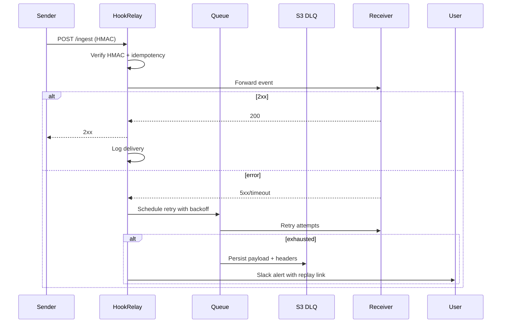
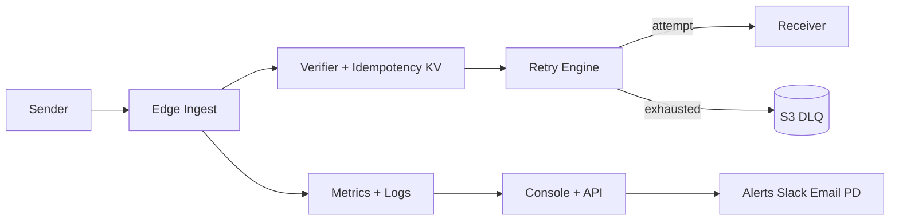

# PRD: HookRelay — Webhook Reliability Proxy

## Summary

Problem: teams drop webhooks or build brittle retry stacks.
Goal: one hosted front door with retries, DLQ, replay, audit, and alerts.
ICP: SaaS teams and platform engineers.
Non-goals: on-prem, PII redaction pipeline, custom BI.

## Users and jobs

- Platform engineer: “Deliver every event reliably and prove it.”
- SRE: “Alert me before customers notice.”
- Dev lead: “Replay and audit in minutes.”

## Success metrics

- Tech: 99.95% uptime. p95 passthrough latency ≤ 250 ms. Delivery success ≥ 99.5%.
- Product: day-7 activation rate ≥ 40% of signups. Trial to paid ≥ 30%.
- Support: ≤ 1 incident page per week at 50 customers.

## Functional requirements

- Ingest endpoints per tenant and per destination.
- HMAC verification compatible with Stripe and GitHub.
- Idempotency keys with seven day window.
- Retry engine with exponential backoff and jitter.
- Dead letter queue with S3 payload storage.
- One click replay and bulk replay.
- Delivery analytics: success rate, p50 and p95, top failures.
- Alerts to Slack and email and PagerDuty.
- API keys, RBAC, audit log.
- Usage metering and Stripe billing.

## Non functional requirements

- Multi region read path.
- Encrypt at rest and in transit.
- Rate limits and IP allow lists.
- Log retention default 30 days. Configurable.

## Flows

## Data model

- Tenant, Endpoint, DeliveryAttempt, ReplayJob, Policy, ApiKey, AuditEntry.

## Minimal API

- `POST /v1/endpoints` create endpoint.
- `POST /v1/replays` body: delivery_ids or dlq_range.
- `GET /v1/deliveries?endpoint_id=…` filter by status.
- `POST /v1/endpoints/{id}/rotate-secret`.

## Security

- HMAC with tenant secret.
- AES256 server side encryption for payloads.
- KMS for key material.
- Signed short lived URLs for payload download.
- GDPR delete per tenant.

## Risks

- Commoditization. Mitigate with UX and analytics depth.
- Customer data sensitivity. Mitigate with PII passthrough mode and field redaction at edge.

## Open questions

- Need message transforms at ingress.
- Need VPC peering for regulated buyers.

## MVP scope

- Ingest, verify, retry, DLQ, replay.
- Console with delivery log.
- Slack and email alerts.
- Metrics p50 p95 success rate.
- Billing.

## MVP dev plan

Week 1

- Edge ingest on Cloudflare Workers or API Gateway.
- Idempotency KV in DynamoDB.
- Retry engine with SQS.
- S3 DLQ payload store.
- Basic React console.

Week 2

- HMAC compat modes.
- Replay API and UI.
- Slack and SES.
- Rate limits and IP allow list.
- Stripe metering.

Testing

- Load test 1k rps passthrough for 10 minutes.
- Fault injection for timeouts and 5xx.

Launch checklist

- Status page.
- Runbooks and on call docs.

MRR prior

- Median 6w $198. Median 12w $594.

