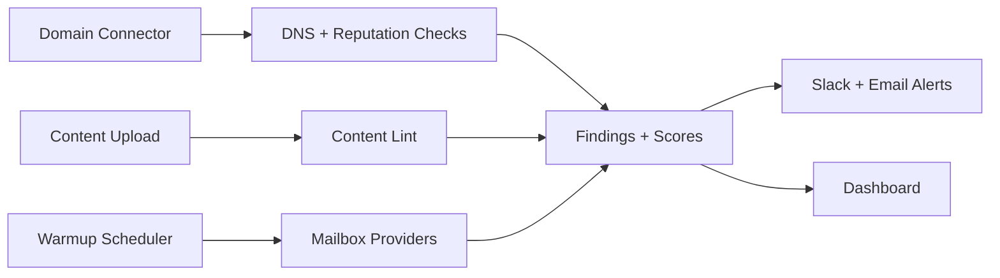
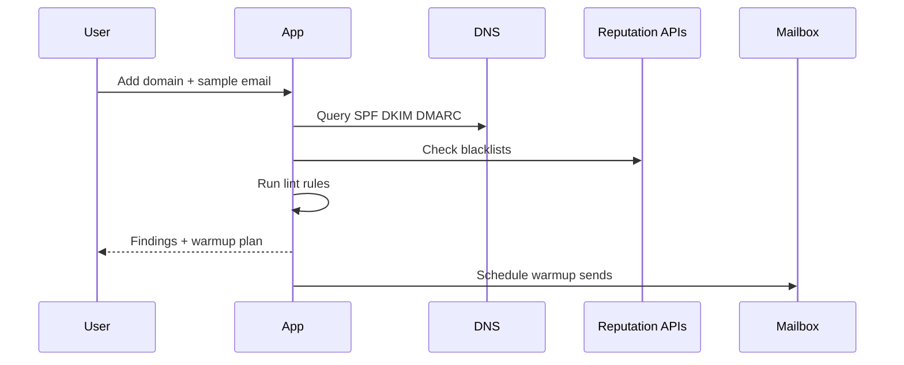

# PRD: InboxHealth — Email Deliverability Monitor

## Summary

Problem: email hits spam folders and domain health drifts.
Goal: monitor domain health, lint content, warm up, and alert.
ICP: growth teams and lifecycle marketers.
Non-goals: sending platform, complex CRM.

## Users and jobs

- Marketer: “Check content and fix issues before send.”
- Ops: “Keep domains healthy.”
- Founder: “Get simple alerts.”

## Success metrics

- Time to detect DNS misconfig ≤ 10 min.
- False positives on lint < 5% against canned set.
- Warmup adherence ≥ 95%.

## Functional requirements

- DNS checks for SPF DKIM DMARC.
- Blacklist and ASN health checks.
- Content lint rules and optional LLM suggestions.
- Warmup scheduler.
- Basic seed inbox placement test.
- Alerts and weekly report.

## Non functional requirements

- Respect provider rate limits.
- No storage of message bodies by default.

## Flow

## Data model

- Domain, CheckRun, Finding, ContentRule, WarmupPlan, SeedResult.

## Minimal API

- `POST /domains` connect domain.
- `POST /content/lint` return issues.
- `POST /warmup/start` with daily targets.
- `GET /findings?domain_id=…`.

## Security

- OAuth for Gmail or Workspace.
- Never persist message bodies unless opted in.

## Risks

- Provider policy changes. Keep warmup conservative.
- Seed results can be noisy. Use rolling median.

## MVP scope

- DNS and blacklist checks.
- Lint rules.
- Warmup scheduler.
- Alerts and weekly digest.
- Billing.

## MVP dev plan

Week 1

- DNS and blacklist checks.
- Lint rules with regex and heuristics.
- Slack and email alerts.

Week 2

- Warmup engine with rate control.
- Workspace OAuth.
- Stripe.

Testing

- Corpus with known spam and ham.
- DNS misconfig scenarios.

Launch checklist

- Clear limits and disclaimers.

MRR prior

- Median 6w $198. Median 12w $396.

