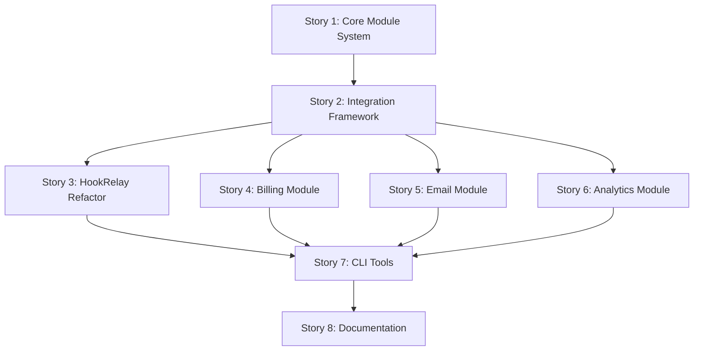

# Project Management Documentation

This directory contains comprehensive project management documentation for the **Modular Startup Platform Foundation** epic.

## Quick Navigation

### 📋 Epic & Stories
- **[Epic Overview](./epic-modular-platform.md)** - High-level vision, goals, and success criteria
- **[Stories Breakdown](./stories-breakdown.md)** - 8 detailed user stories with priorities and dependencies
- **[Detailed Tasks](./tasks-detailed.md)** - Specific, actionable tasks with acceptance criteria

### 📊 Planning & Templates
- **[Templates & Guidelines](./templates-and-guidelines.md)** - Estimation guidelines, templates, and best practices
- **[Risk Assessment](./epic-modular-platform.md#risk-assessment)** - Risk analysis and mitigation strategies

## Project Overview

**Epic**: Modular Startup Platform Foundation  
**Duration**: 12-16 weeks  
**Team Size**: 6-8 developers  
**Priority**: Critical for platform growth  

### Key Deliverables

1. **Core Module System** - Enterprise-grade foundation with SOLID principles
2. **Integration Framework** - Event-driven architecture with dependency injection  
3. **Reference Implementation** - HookRelay refactored as first module
4. **Business Modules** - Billing, Email, and Analytics modules
5. **Developer Tooling** - CLI tools for module management
6. **Documentation** - Comprehensive guides and examples

## Story Dependencies

## Estimation Summary

| Story | Effort (weeks) | Priority | Risk Level | Story Points |
|-------|---------------|----------|------------|--------------|
| Core Module System | 2-3 | Critical | Medium | 21 |
| Integration Framework | 2-3 | Critical | High | 18 |
| HookRelay Refactor | 2-3 | High | Medium | 15 |
| Billing Module | 3-4 | High | High | 24 |
| Email Module | 2-3 | Medium | Low | 18 |
| Analytics Module | 3-4 | Medium | Medium | 21 |
| CLI Tools | 2-3 | Medium | Low | 15 |
| Documentation | 2-3 | Medium | Low | 12 |

**Total**: 144 story points across 18-26 weeks (with parallel development)

## Success Metrics

### Technical Excellence
- [ ] 100% SOLID principle compliance
- [ ] All modules follow ModuleStrategy interface
- [ ] >95% test coverage across all modules
- [ ] Performance benchmarks meet requirements
- [ ] Zero breaking changes to existing RBAC functionality

### Developer Experience
- [ ] 80% reduction in infrastructure development time
- [ ] Module scaffolding tools functional
- [ ] Comprehensive documentation with working examples
- [ ] 4.5+ star developer satisfaction rating

### Business Value
- [ ] 5+ modules successfully integrated
- [ ] Platform supports 1000+ concurrent users
- [ ] Module marketplace foundation ready
- [ ] Revenue generation capability through billing module

## Getting Started

### For Project Managers
1. Review the [Epic Overview](./epic-modular-platform.md) for business context
2. Use [Templates & Guidelines](./templates-and-guidelines.md) for sprint planning
3. Monitor progress using the story point tracking system

### For Developers  
1. Read [Stories Breakdown](./stories-breakdown.md) for technical requirements
2. Follow [Detailed Tasks](./tasks-detailed.md) for implementation guidance
3. Use code review checklists from templates for quality assurance

### For Stakeholders
1. Track business value delivery through story completion
2. Review architecture decisions in weekly reviews
3. Validate module functionality through demo sessions

## Quality Gates

Each story must pass through defined quality gates:

1. **Design Review** - Architecture and SOLID compliance
2. **Implementation Review** - Code quality and testing  
3. **Integration Review** - End-to-end functionality
4. **Production Readiness** - Performance and security validation

## Communication Plan

- **Daily Standups**: Progress tracking and blocker resolution
- **Weekly Architecture Reviews**: Design decisions and technical debt
- **Sprint Reviews**: Feature demos and stakeholder feedback  
- **Retrospectives**: Process improvements and lessons learned

## Risk Management

**High-Risk Areas**:
- Integration Framework complexity (Story 2)
- Billing Module security requirements (Story 4)
- Performance impact of module indirection

**Mitigation Strategies**:
- Early proof-of-concepts for complex integrations
- Security-first approach with regular reviews
- Continuous performance monitoring and optimization

---

This project represents a significant architectural evolution that will position the platform for scalable growth while maintaining enterprise-grade quality standards. Success depends on strict adherence to SOLID principles, comprehensive testing, and continuous stakeholder engagement throughout the development process.