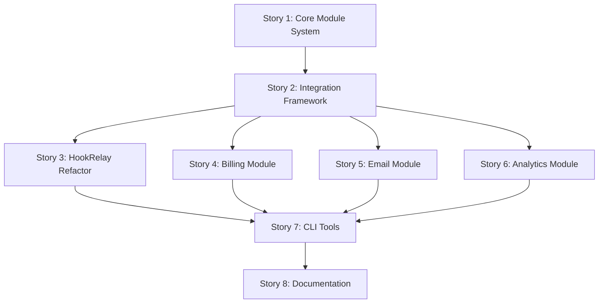

# Stories Breakdown: Modular Platform Foundation

**Epic**: [Modular Startup Platform Foundation](./epic-modular-platform.md)  
**Total Stories**: 8  
**Estimated Duration**: 12-16 weeks  

## Story Priority & Dependencies

---

## Story 1: Core Module System Architecture

**Story ID**: STORY-001  
**Priority**: Critical (Blocker)  
**Estimated Effort**: 2-3 weeks  
**Dependencies**: None  

### User Story
**As a** developer  
**I want** a robust module system foundation  
**So that** I can add new business modules without breaking existing functionality  

### Business Value
- Enables all future module development
- Provides enterprise-grade architecture foundation
- Ensures SOLID principle compliance from the start

### Acceptance Criteria
- [ ] ModuleStrategy interface implemented with all required methods
- [ ] Module lifecycle management (install, configure, start, stop, uninstall)
- [ ] Module health monitoring and status reporting
- [ ] TypeScript strict mode compliance
- [ ] 100% unit test coverage on core system
- [ ] Performance benchmarking shows <5ms overhead per module operation

### Technical Requirements
- Factory pattern for module instantiation
- Strategy pattern for module implementations
- Comprehensive error handling and logging
- Module version compatibility checking
- Thread-safe module operations

---

## Story 2: Module Integration Framework

**Story ID**: STORY-002  
**Priority**: Critical  
**Estimated Effort**: 2-3 weeks  
**Dependencies**: Story 1  

### User Story
**As a** platform architect  
**I want** standardized module integration patterns  
**So that** all modules follow consistent interfaces and can communicate safely  

### Business Value
- Ensures consistent module quality
- Enables loose coupling between modules
- Reduces integration bugs and conflicts

### Acceptance Criteria
- [ ] Dependency injection container implemented
- [ ] Event bus for inter-module communication
- [ ] Chain of responsibility for middleware processing
- [ ] Module configuration validation system
- [ ] Circular dependency detection and prevention
- [ ] Integration tests covering all communication patterns

### Technical Requirements
- Observer pattern for event subscriptions
- Dependency inversion principle implementation
- Type-safe event payloads
- Module sandboxing and security boundaries
- Performance monitoring for event processing

---

## Story 3: HookRelay Module Refactoring

**Story ID**: STORY-003  
**Priority**: High  
**Estimated Effort**: 2-3 weeks  
**Dependencies**: Story 2  

### User Story
**As a** developer  
**I want** HookRelay converted to the new module system  
**So that** it serves as a reference implementation for future modules  

### Business Value
- Validates module system design with real-world use case
- Provides reference implementation for other developers
- Maintains existing webhook functionality during transition

### Acceptance Criteria
- [ ] HookRelay services implement ModuleStrategy interface
- [ ] Zero downtime migration from current implementation
- [ ] All existing webhook functionality preserved
- [ ] Event publishing for webhook lifecycle events
- [ ] Admin UI integration for webhook management
- [ ] Performance matches or exceeds current implementation

### Technical Requirements
- Backward compatibility with existing webhook configurations
- Event-driven architecture for webhook processing
- Proper separation of concerns between ingestion and processing
- LocalStack integration for local development
- Comprehensive E2E tests for webhook flows

---

## Story 4: Billing Module Implementation

**Story ID**: STORY-004  
**Priority**: High  
**Estimated Effort**: 3-4 weeks  
**Dependencies**: Story 2  

### User Story
**As a** startup founder  
**I want** a ready-to-use billing module  
**So that** I can implement Stripe payments without building from scratch  

### Business Value
- Immediate revenue generation capability for platform users
- Demonstrates module system value with complex business logic
- Reduces time-to-market for SaaS applications

### Acceptance Criteria
- [ ] Stripe integration with webhook handling
- [ ] Subscription management (create, update, cancel)
- [ ] Usage-based billing and metering
- [ ] Invoice generation and management
- [ ] Integration with RBAC for payment-based permissions
- [ ] Admin UI for subscription management
- [ ] Comprehensive payment flow E2E tests

### Technical Requirements
- Event-driven billing lifecycle management
- Idempotent payment processing
- PCI compliance considerations
- Webhook signature verification
- Error handling for payment failures
- Integration with existing user management system

---

## Story 5: Email Module Implementation

**Story ID**: STORY-005  
**Priority**: Medium  
**Estimated Effort**: 2-3 weeks  
**Dependencies**: Story 2  

### User Story
**As a** product team  
**I want** a transactional email system  
**So that** I can send user notifications and marketing emails reliably  

### Business Value
- Essential communication capability for user engagement
- Reduces dependency on external email services
- Enables personalized user communications

### Acceptance Criteria
- [ ] Multi-provider support (SES, SendGrid, etc.)
- [ ] React-based email template system
- [ ] Event-driven email triggers
- [ ] Email delivery tracking and analytics
- [ ] Bounce and complaint handling
- [ ] Email preference management
- [ ] Anti-spam compliance features

### Technical Requirements
- Strategy pattern for email provider abstraction
- Template compilation and rendering system
- Queue-based email processing
- Retry logic for failed deliveries
- Email analytics and reporting
- GDPR compliance for email data

---

## Story 6: Analytics Module Implementation

**Story ID**: STORY-006  
**Priority**: Medium  
**Estimated Effort**: 3-4 weeks  
**Dependencies**: Story 2  

### User Story
**As a** growth team  
**I want** built-in analytics and tracking  
**So that** I can measure user behavior and product metrics  

### Business Value
- Data-driven decision making capability
- User behavior insights for product optimization
- Custom analytics without external dependencies

### Acceptance Criteria
- [ ] Event tracking with configurable privacy levels
- [ ] Real-time dashboard widgets
- [ ] Funnel analysis and conversion tracking
- [ ] Cohort analysis and retention metrics
- [ ] Custom event definitions and tracking
- [ ] Data export and reporting APIs
- [ ] GDPR-compliant data handling

### Technical Requirements
- Privacy-first analytics design
- Real-time data processing pipeline
- Configurable data retention policies
- Dashboard widget framework
- API for custom reporting
- Performance optimized for high-volume events

---

## Story 7: Module CLI Tools

**Story ID**: STORY-007  
**Priority**: Medium  
**Estimated Effort**: 2-3 weeks  
**Dependencies**: Stories 3, 4, 5, 6  

### User Story
**As a** developer  
**I want** CLI tools for module management  
**So that** I can quickly scaffold and manage modules  

### Business Value
- Improved developer experience and productivity
- Consistent module structure and quality
- Reduced onboarding time for new developers

### Acceptance Criteria
- [ ] `yarn create-module <name>` scaffolding command
- [ ] Module installation and dependency management
- [ ] Health check and diagnostic commands
- [ ] Module documentation generation
- [ ] Integration with existing yarn scripts
- [ ] Cross-platform compatibility (Mac, Linux, Windows)

### Technical Requirements
- Interactive CLI with prompts and validation
- Template system for module scaffolding
- Dependency resolution and conflict detection
- Module registry and marketplace preparation
- Comprehensive error messages and help system

---

## Story 8: Platform Documentation & Examples

**Story ID**: STORY-008  
**Priority**: Medium  
**Estimated Effort**: 2-3 weeks  
**Dependencies**: Story 7  

### User Story
**As a** new developer  
**I want** comprehensive documentation and examples  
**So that** I can understand and extend the platform effectively  

### Business Value
- Faster developer onboarding and adoption
- Reduced support burden through self-service documentation
- Platform credibility through professional documentation

### Acceptance Criteria
- [ ] Complete module development guide
- [ ] SOLID principles implementation examples
- [ ] Design pattern usage documentation
- [ ] Interactive module explorer in admin UI
- [ ] Video tutorials for common workflows
- [ ] API reference documentation
- [ ] Troubleshooting guide and FAQ

### Technical Requirements
- Documentation site with search functionality
- Code examples that stay up-to-date
- Interactive documentation components
- Multi-language support preparation
- SEO optimization for documentation discoverability
- Integration with existing documentation structure

## Estimation Summary

| Story | Effort (weeks) | Priority | Risk Level |
|-------|---------------|----------|------------|
| Story 1: Core Module System | 2-3 | Critical | Medium |
| Story 2: Integration Framework | 2-3 | Critical | High |
| Story 3: HookRelay Refactor | 2-3 | High | Medium |
| Story 4: Billing Module | 3-4 | High | High |
| Story 5: Email Module | 2-3 | Medium | Low |
| Story 6: Analytics Module | 3-4 | Medium | Medium |
| Story 7: CLI Tools | 2-3 | Medium | Low |
| Story 8: Documentation | 2-3 | Medium | Low |

**Total Estimated Effort**: 18-26 weeks (with parallel development)  
**Critical Path Duration**: 12-16 weeks  