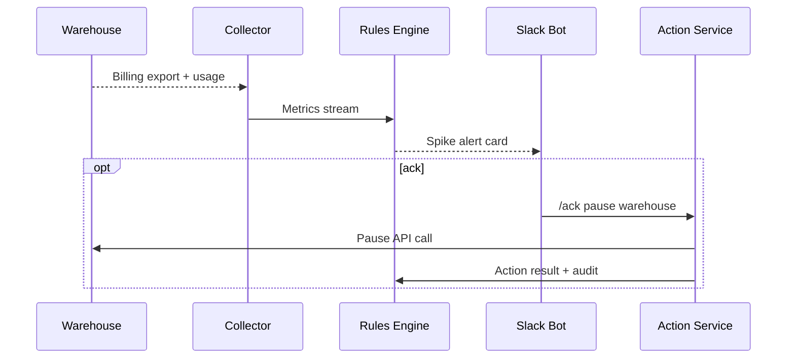
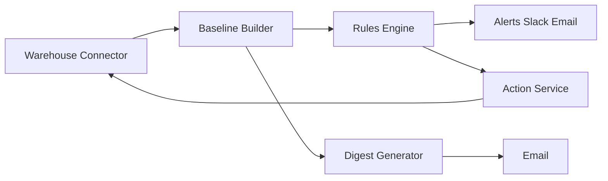

# PRD: WarehouseWatch — Data Warehouse Cost Guard

## Summary

Problem: surprise Snowflake or BigQuery bills.
Goal: detect spikes and act within minutes.
ICP: data leads and finance ops.
Non-goals: full BI, chargeback, complex forecasting.

## Users and jobs

- Data lead: “Alert and auto pause runaway spend.”
- Finance: “Weekly digest with saved dollars.”
- Engineer: “Preview costs in PRs.”

## Success metrics

- Alert time to detect ≤ 5 min for spikes.
- False positive rate ≤ 10%.
- At least five acknowledged alerts per tenant per month.

## Functional requirements

- Connectors for Snowflake then BigQuery.
- Baselines per role or warehouse.
- Detectors: spend spikes, long queries, skewed credit burn.
- Auto actions: pause user or warehouse.
- Slack bot with ack and unpause.
- Weekly email digest.
- Read only by default. Action token separate.

## Non functional requirements

- Safe backoff to never exceed provider API quotas.
- Every action must create an audit record.

## Flow

## Data model

- Account, Warehouse, Role, Baseline, DetectorEvent, Action, AuditEntry.

## Minimal API

- `POST /connect/snowflake` with read only creds.
- `POST /actions/pause` body: warehouse_id.
- `GET /events?since=…`.

## Security

- Separate store for action token.
- IP allow list for warehouse endpoints.
- Rotate secrets on a schedule.

## Risks

- Provider UI parity closes the gap. Focus on actions and PR-time previews.
- Read only access limits value. Offer optional action token.

## MVP scope

- Snowflake connector.
- Spike and long query detectors.
- Slack alerts.
- Pause warehouse action.
- Weekly digest.
- Billing.

## MVP dev plan

Week 1

- Snowflake usage collector.
- Baseline and spike rules.
- Slack alert cards.

Week 2

- Action service and RBAC.
- Digest emails.
- Stripe.

Testing

- Replay a month of sample usage.
- Synthetic spikes.

Launch checklist

- Security review of action token path.

MRR prior

- Median 6w $298. Median 12w $596.

